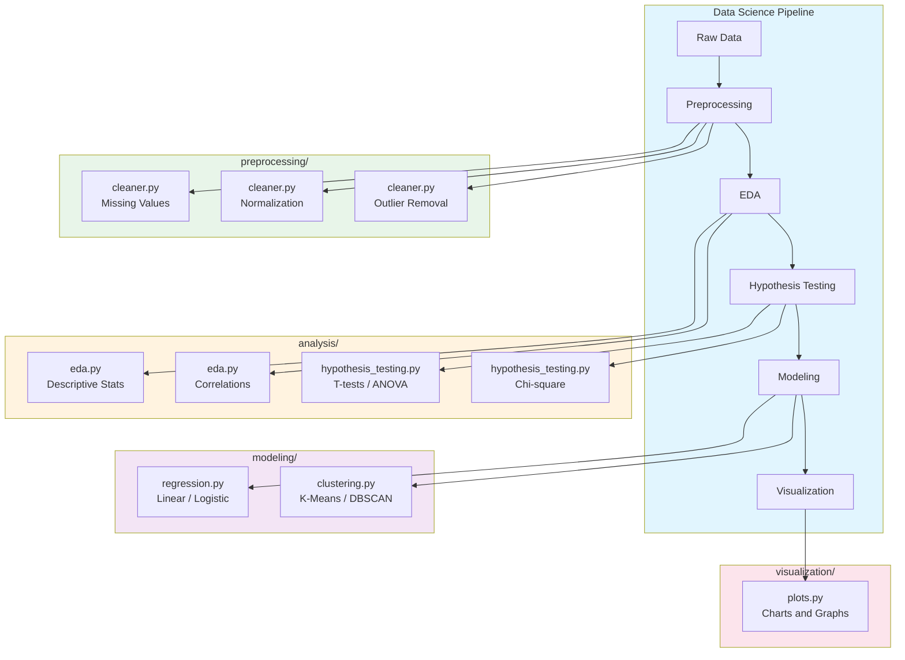
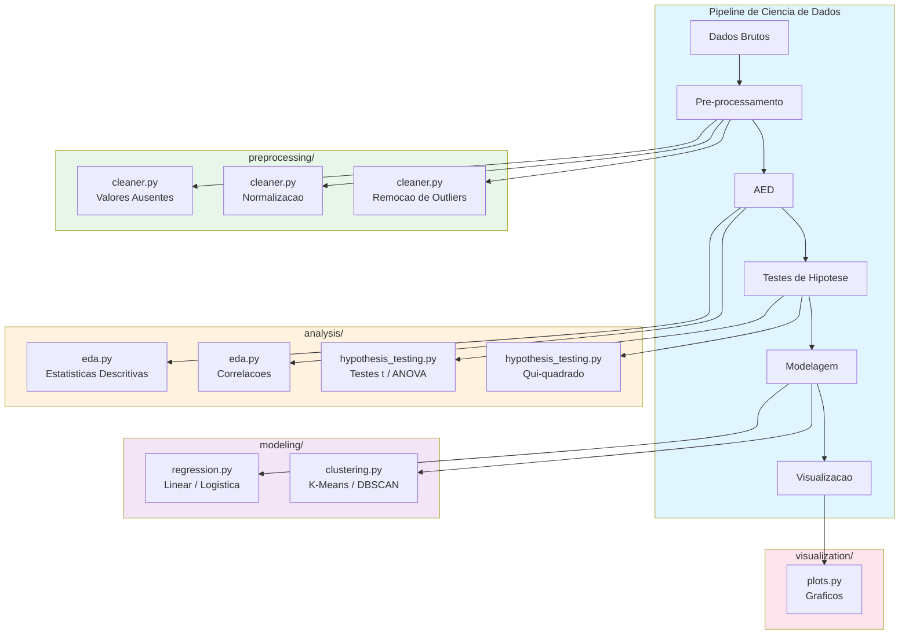

# Data Science Portfolio

> Coursera - Data Science Specialization


[English](#english) | [Portugues](#portugues)

---

## English

### Overview

**Data Science Portfolio** is a comprehensive Python data science toolkit that implements core algorithms and utilities from scratch using NumPy and SciPy. The project covers the full data science pipeline: data preprocessing, exploratory analysis, statistical testing, machine learning modeling, and visualization.

The codebase comprises **1,500+** lines of source code organized across **6 modules**, demonstrating proficiency in statistical analysis, machine learning fundamentals, and data engineering best practices.

### Key Features

- **Exploratory Data Analysis**: Descriptive statistics, distributions, correlation analysis, and outlier detection
- **Hypothesis Testing**: T-tests (independent, paired, one-sample), chi-square tests, and one-way ANOVA
- **Regression Models**: Linear regression (OLS via normal equation) and logistic regression (gradient descent)
- **Clustering Algorithms**: K-Means with multiple restarts and DBSCAN density-based clustering
- **Data Preprocessing**: Missing value imputation, outlier treatment, normalization (min-max, z-score, robust, L2)
- **Visualization**: Matplotlib wrapper functions for histograms, scatter plots, heatmaps, box plots, and bar charts

### Architecture



### Quick Start

#### Prerequisites

- Python 3.9+
- pip

#### Installation

```bash
git clone https://github.com/galafis/datasciencecoursera.git
cd datasciencecoursera
pip install -r requirements.txt
```

#### Usage

```bash
# Run the full demo pipeline
python main.py

# Run tests
pytest tests/ -v
```

### Project Structure

```
datasciencecoursera/
├── main.py
├── requirements.txt
├── src/
│   ├── analysis/
│   │   ├── eda.py
│   │   └── hypothesis_testing.py
│   ├── modeling/
│   │   ├── regression.py
│   │   └── clustering.py
│   ├── preprocessing/
│   │   └── cleaner.py
│   └── visualization/
│       └── plots.py
├── tests/
│   └── test_analysis.py
├── LICENSE
└── README.md
```

### Tech Stack

| Technology   | Description              | Role                    |
|-------------|--------------------------|-------------------------|
| Python 3.9+ | Programming language     | Core runtime            |
| NumPy       | Numerical computing      | Array operations        |
| SciPy       | Scientific computing     | Statistical functions   |
| Pandas      | Data manipulation        | DataFrame operations    |
| Matplotlib  | Plotting library         | Data visualization      |
| Pytest      | Testing framework        | Unit testing            |

### Contributing

Contributions are welcome! Please feel free to submit a Pull Request.

1. Fork the project
2. Create your feature branch (`git checkout -b feature/AmazingFeature`)
3. Commit your changes (`git commit -m 'Add some AmazingFeature'`)
4. Push to the branch (`git push origin feature/AmazingFeature`)
5. Open a Pull Request

### License

This project is licensed under the MIT License - see the [LICENSE](LICENSE) file for details.

### Author

**Gabriel Demetrios Lafis**
- GitHub: [@galafis](https://github.com/galafis)
- LinkedIn: [Gabriel Demetrios Lafis](https://linkedin.com/in/gabriel-demetrios-lafis)

---

## Portugues

### Visao Geral

**Data Science Portfolio** e um kit de ferramentas abrangente de ciencia de dados em Python que implementa algoritmos e utilitarios fundamentais do zero usando NumPy e SciPy. O projeto cobre todo o pipeline de ciencia de dados: pre-processamento, analise exploratoria, testes estatisticos, modelagem de machine learning e visualizacao.

A base de codigo compreende **1.500+** linhas de codigo-fonte organizadas em **6 modulos**, demonstrando proficiencia em analise estatistica, fundamentos de machine learning e boas praticas de engenharia de dados.

### Funcionalidades Principais

- **Analise Exploratoria de Dados**: Estatisticas descritivas, distribuicoes, analise de correlacao e deteccao de outliers
- **Testes de Hipotese**: Testes t (independente, pareado, uma amostra), qui-quadrado e ANOVA one-way
- **Modelos de Regressao**: Regressao linear (OLS via equacao normal) e regressao logistica (gradiente descendente)
- **Algoritmos de Clusterizacao**: K-Means com multiplas inicializacoes e DBSCAN baseado em densidade
- **Pre-processamento**: Imputacao de valores ausentes, tratamento de outliers, normalizacao (min-max, z-score, robusta, L2)
- **Visualizacao**: Funcoes wrapper do Matplotlib para histogramas, dispersao, heatmaps, box plots e graficos de barras

### Arquitetura



### Inicio Rapido

#### Pre-requisitos

- Python 3.9+
- pip

#### Instalacao

```bash
git clone https://github.com/galafis/datasciencecoursera.git
cd datasciencecoursera
pip install -r requirements.txt
```

#### Uso

```bash
# Executar o pipeline de demonstracao completo
python main.py

# Executar testes
pytest tests/ -v
```

### Estrutura do Projeto

```
datasciencecoursera/
├── main.py
├── requirements.txt
├── src/
│   ├── analysis/
│   │   ├── eda.py
│   │   └── hypothesis_testing.py
│   ├── modeling/
│   │   ├── regression.py
│   │   └── clustering.py
│   ├── preprocessing/
│   │   └── cleaner.py
│   └── visualization/
│       └── plots.py
├── tests/
│   └── test_analysis.py
├── LICENSE
└── README.md
```

### Stack Tecnologica

| Tecnologia   | Descricao                | Papel                     |
|-------------|--------------------------|---------------------------|
| Python 3.9+ | Linguagem de programacao | Runtime principal         |
| NumPy       | Computacao numerica      | Operacoes com arrays      |
| SciPy       | Computacao cientifica    | Funcoes estatisticas      |
| Pandas      | Manipulacao de dados     | Operacoes com DataFrames  |
| Matplotlib  | Biblioteca de graficos   | Visualizacao de dados     |
| Pytest      | Framework de testes      | Testes unitarios          |

### Contribuindo

Contribuicoes sao bem-vindas! Sinta-se a vontade para enviar um Pull Request.

### Licenca

Este projeto esta licenciado sob a Licenca MIT - veja o arquivo [LICENSE](LICENSE) para detalhes.

### Autor

**Gabriel Demetrios Lafis**
- GitHub: [@galafis](https://github.com/galafis)
- LinkedIn: [Gabriel Demetrios Lafis](https://linkedin.com/in/gabriel-demetrios-lafis)
